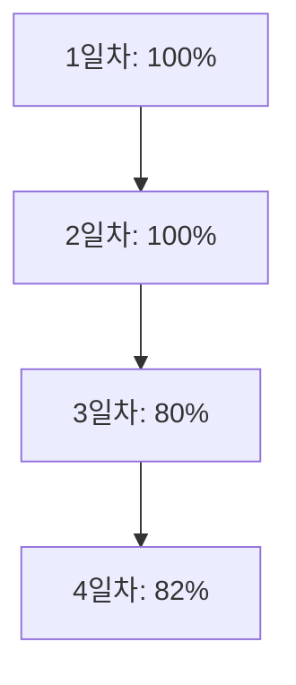

# 릴레이 2주차

## 프롬프트
You said: 주어진 데이터에 대해 유저의 학습률을 기록하고 그래프로
주어진 데이터에 대해 유저의 학습률을 기록하고 그래프로 구현하여 하나의 마크다운 파일로 출력
1일차: 총 20개 체크포인트 중 20개 완료
2일차: 총 7개 체크포인트 중 7개 완료
3일차: 총 20개 중 16개 완료
4일차: 총 17개 중 14개 완료

## 결과
아래 표와 그래프는 4일간의 학습 체크포인트 완료 현황을 보여줍니다.

| 일차 | 전체 체크포인트 | 완료 체크포인트 | 학습률(%) |
|------|----------------|----------------|-----------|
| 1일차 | 20             | 20             | 100%      |
| 2일차 | 7              | 7              | 100%      |
| 3일차 | 20             | 16             | 80%       |
| 4일차 | 17             | 14             | 82%       |

## 학습률 변화 그래프

- **1, 2일차**: 모든 체크포인트를 완료하여 학습률이 100%입니다.
- **3일차**: 80%의 체크포인트를 완료하였습니다.
- **4일차**: 82%의 체크포인트를 완료하였습니다.

> 꾸준한 학습이 이루어지고 있으며, 각 일차별 완료 현황을 참고하여 다음 목표를 설정할 수 있습니다.
